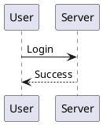

# Diagram as Code - Nội dung trình bày

## Slide 1 - Diagram trong dự án phần mềm đang có vấn đề gì?

### Pain point

- Sơ đồ thường được vẽ thủ công bằng draw.io hoặc công cụ kéo thả.
- Sau khi vẽ, người dùng export thành PNG/SVG rồi đưa vào tài liệu.
- File ảnh không thể hiện rõ nội dung nào đã thay đổi.
- Khi source code thay đổi, sơ đồ thường không được cập nhật theo.
- Mỗi thành viên có thể dùng một công cụ hoặc cách trình bày khác nhau.

### Thông điệp chính

> Sơ đồ đang được quản lý như một file ảnh, trong khi nó nên được quản lý như source code.

### Gợi ý hình minh họa

```text
Source code thay đổi ──────> Hệ thống thực tế

Sơ đồ cũ ─────────────────> Không còn đúng
```

---

## Slide 2 - Pain point gây ra hậu quả như thế nào?

- Reviewer chỉ thấy một ảnh mới, không biết chính xác node hoặc luồng nào đã đổi.
- Sơ đồ và source code dễ mô tả hai phiên bản khác nhau của hệ thống.
- Developer mới mất thời gian xác minh tài liệu còn đúng hay không.
- Việc sửa sơ đồ phụ thuộc vào người có file gốc hoặc công cụ vẽ phù hợp.
- Tài liệu kiến trúc dần mất độ tin cậy và ít được sử dụng.

### Tác động tới dự án

```text
Khó review
    +
Khó version control
    +
Tài liệu lỗi thời
    =
Tăng thời gian trao đổi và tăng rủi ro hiểu sai hệ thống
```

---

## Slide 3 - Giải pháp: Diagram as Code

Diagram as Code cho phép mô tả sơ đồ bằng văn bản:



Văn bản được lưu cạnh source code, sau đó hệ thống tự chuyển thành SVG.

### Giá trị mang lại

- Source sơ đồ có thể commit, diff, review và merge như code.
- Lịch sử thay đổi được lưu đầy đủ trong Git.
- Developer có thể sửa sơ đồ ngay trong VS Code.
- Ảnh SVG được tạo lại từ source thay vì chỉnh sửa thủ công.
- CI phát hiện ảnh bị thiếu hoặc không còn khớp source.

### Thông điệp chính

> Source là dữ liệu gốc; hình ảnh là kết quả được tạo ra từ source.

---

## Slide 4 - Sản phẩm giải quyết vấn đề như thế nào?

Sản phẩm gồm ba thành phần chính:

### 1. Rendering service

- Gateway nhận source sơ đồ qua API.
- Gateway xác thực bằng API key, kiểm tra request và quản lý cache.
- Kroki/renderer chuyển Mermaid, PlantUML, Graphviz hoặc D2 thành SVG.
- Có thể self-host trên máy của tổ chức để source không đi qua dịch vụ bên ngoài.

### 2. VS Code extension

- Preview sơ đồ ngay bên cạnh editor.
- Tự cập nhật Preview sau khi Save.
- Export SVG bằng một nút bấm khi người dùng muốn lưu ảnh.
- API key được lưu bằng VS Code SecretStorage.

### 3. GitHub Action

- Kiểm tra source sơ đồ thay đổi trong Pull Request.
- Phát hiện SVG bị thiếu, cũ hoặc cần xóa.
- Ngăn merge khi source và ảnh không đồng bộ.
- Không cần chạy self-hosted runner nếu PR không thay đổi diagram.

### Luồng kiến trúc

```text
VS Code Extension ──POST /v1/render──> Gateway ──> Kroki/Renderer
       │                                  │
       └──────── Preview / Export SVG <───┘

GitHub Action ─────POST /v1/render────> Gateway
       │
       └──────── So sánh SVG đã commit
```

---

## Slide 5 - Scope sản phẩm cover đến đâu?

### MVP hiện tại đã cover

- Self-hosted Gateway chạy trên Windows thông qua Docker Desktop.
- API key authentication và Gateway chỉ mở tại `localhost` mặc định.
- Render Mermaid `.mmd`, PlantUML `.puml`, Graphviz `.dot` và D2 `.d2`.
- Output chuẩn hiện tại là SVG.
- Preview, Refresh và Export trong VS Code.
- Cấu hình dự án bằng `.diagramrc.yml`.
- GitHub Action kiểm tra SVG đã commit.
- Windows installer, VSIX và GitHub Release để phân phối sản phẩm.

### Chưa nằm trong MVP hiện tại

- Không tự quét source code ứng dụng để suy ra kiến trúc.
- Chưa tự đọc code block trong README, Issue hoặc nội dung PR.
- Chưa có GitHub App/bot đăng ảnh vào comment.
- GitHub Action chưa tự commit SVG sau khi render.
- Chưa hỗ trợ PNG/PDF trong workflow sản phẩm hiện tại.
- Chưa có playground, SaaS billing, database hoặc hệ thống quản lý người dùng.

### Bước mở rộng tiếp theo

- Bổ sung chế độ `generate` để Action tự render và commit SVG.
- Sau đó mới mở rộng Markdown parser và GitHub App cho Issue/PR.

---

## Slide 6 - Main user workflow

### Bước 1: Viết source sơ đồ

Developer tạo hoặc sửa file trong:

```text
docs/diagrams/login-flow.puml
```

### Bước 2: Xem trước trong VS Code

- Bấm Preview để mở sơ đồ bên cạnh editor.
- Chỉnh sửa source và nhấn `Ctrl + S`.
- Preview được cập nhật nhưng chưa tạo file ảnh mới.

### Bước 3: Export ảnh

- Khi sơ đồ đã đúng, developer bấm Export.
- Extension tạo hoặc cập nhật:

```text
docs/generated/login-flow.svg
```

### Bước 4: Commit và tạo Pull Request

Developer commit cả hai file:

```text
Source: docs/diagrams/login-flow.puml
Image:  docs/generated/login-flow.svg
```

### Bước 5: CI kiểm tra

- GitHub Action render lại source bằng cùng Gateway.
- Action so sánh kết quả với SVG đã commit.
- Khớp thì PR được tiếp tục; không khớp thì CI chỉ rõ file cần cập nhật.

### Workflow tổng quát

```text
Write source
    ↓
Preview trong VS Code
    ↓
Export SVG
    ↓
Commit source + SVG
    ↓
Mở Pull Request
    ↓
GitHub Action kiểm tra
    ↓
Review và Merge
```

---

## Slide 7 - Kết quả mang lại

- Sơ đồ sống cùng source code và cùng vòng đời phát triển phần mềm.
- Mọi thay đổi đều có lịch sử, diff và người review.
- Developer chỉnh sửa và kiểm tra sơ đồ trong công cụ quen thuộc.
- CI bảo vệ repository khỏi tài liệu lỗi thời.
- Tổ chức có thể self-host để kiểm soát source và hạ tầng render.

### Câu kết

> Diagram as Code biến sơ đồ từ một ảnh tĩnh thành một phần có thể kiểm thử và review của dự án phần mềm.
